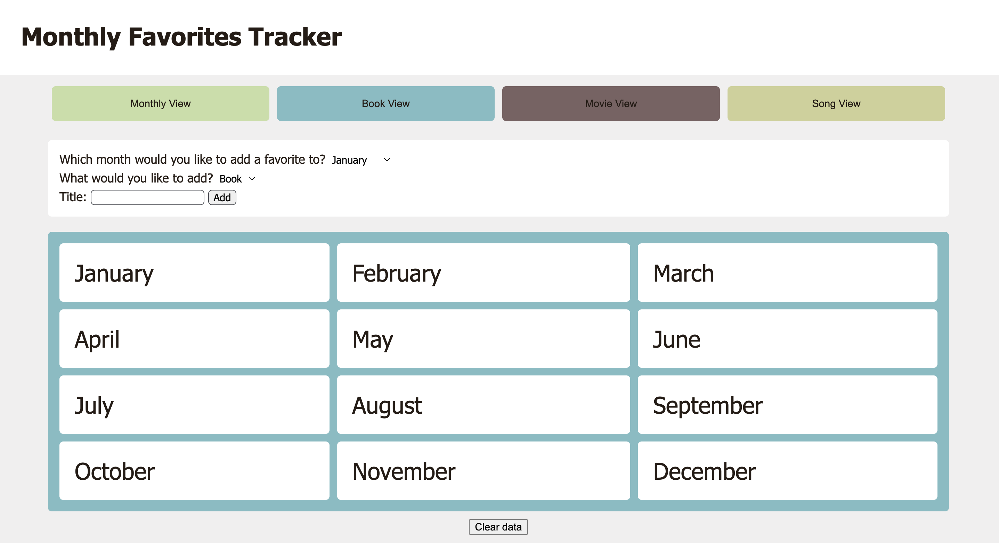
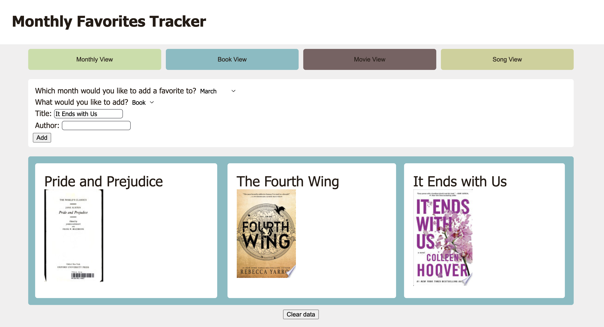

# Favorites Tracker

**Favorites Tracker** is a web application that allows users to save their favorite **book**, **song**, and **movie** for each month. Users can view these favorites by category or browse them by month. The application is built with **HTML**, **CSS**, and **JavaScript** and fetches book images using the Google Books API.

## Images

Empty monthly view

Book view

